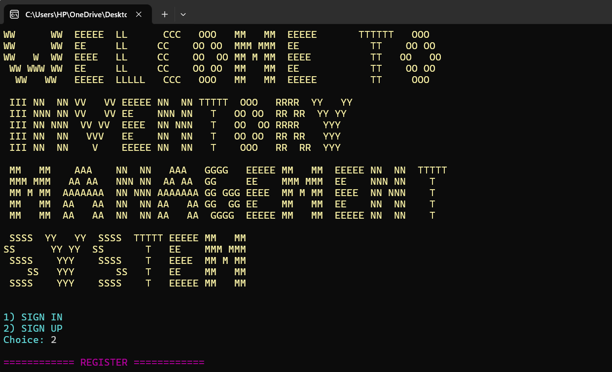

# Inventory-Management-System  

A **C-based console Inventory Management System** designed to manage products, record sales, restock low-quantity items, and maintain persistent user-specific data.  

---

## Preview  
  

---

## Overview  

This application simplifies product management through a **menu-driven console interface** with **user authentication**, ensuring secure access. It uses **file handling** for persistent data storage, making it lightweight yet functional. The program also enhances user experience with **colored text** and **ASCII art** for a visually appealing introduction.  

---

## Key Features  

### 1. User Authentication  
- **Sign Up**: Create a new account and store credentials securely in `users.txt`.  
- **Sign In**: Authenticate to access a personalized inventory.  
- **User-Specific Data**: Each user has a separate inventory file (`<username>_inventory.txt`) to keep data isolated.  

### 2. Inventory Management  
- **Add Product**: Add products with details like **ID**, **Name**, **Price**, **Quantity**, and **Items Sold**.  
- **Display Products**: View all products in a **tabular format** for better readability.  
- **Delete Product**: Remove a product by specifying its **ID**.  
- **Update Product**: Modify product details such as **name, price, or quantity**.  
- **Search Product**: Quickly search for a product by its **ID**.  
- **Product Sold**: Record sales and automatically update inventory quantities and items sold.  
- **Sorting**: Sort products dynamically by **price**, **quantity**, or **name**.  
- **Restock Alerts**: Identify low-stock products (**quantity < 10**) for restocking decisions.  

### 3. File Handling  
- **Persistent User Data**: Credentials are stored in `users.txt`.  
- **Inventory Files**: Each user’s inventory is stored separately as `<username>_inventory.txt`.  
- **Data Safety**: Inventory changes are saved immediately to prevent data loss.  

### 4. Error Handling  
- **Input Validation**: Ensures only valid product details and credentials are entered.  
- **Clear Messages**: Displays meaningful error or success messages.  
- **Safe Operations**: Prevents accidental deletion or invalid updates.  

### 5. User-Friendly Console Interface  
- **Colored Text**: Highlights important information, errors, and success messages.  
- **ASCII Art**: Displays at program start for a **visually engaging introduction**.

---

## Why It Stands Out  

- ✅ **Lightweight**: Runs on any OS with a C compiler  
- ✅ **Secure & Personalized**: Separate inventory files for each user  
- ✅ **Feature-Rich**: From CRUD operations to sorting and restocking alerts  
- ✅ **Beginner-Friendly**: A great example of file handling and modular programming in C

---

## System Architecture  

### Main Components  
- **Authentication Module**: Manages sign-up/sign-in and credential validation  
- **Inventory Module**: Handles all CRUD operations, sorting, and restocking  
- **Sales Recorder**: Updates inventory data after product sales  

### Data Handling  
- `.txt` files store user credentials and inventories  
- User-specific inventory files ensure isolated and secure data  
- Immediate save mechanism prevents data loss

---

## Usage  

### Authentication Flow  
1. Launch the program → Choose **Sign Up** (new user) or **Sign In** (existing user)  
2. Enter credentials to gain access to your personalized inventory  

### Inventory Flow  
1. Access the **Inventory Menu** after logging in  
2. Perform any operation:  
   - Add new products  
   - Display, sort, or search products  
   - Update or delete products  
   - Record sales and auto-update stock  
   - Restock low-quantity items

---

## Requirements  

- **C Compiler** (GCC, Clang, or any standard C compiler)  
- Compatible with **Windows, macOS, and Linux**  
- No external libraries required

---

## Future Improvements  

- Encrypt stored credentials for better security  
- Add CSV export/import support  
- Implement **multi-user simultaneous access**  
- Advanced reporting (e.g., monthly sales summaries)  
- Optionally build a graphical interface

---

## License  

This project is for **academic and educational use**. Please give credit if reused or modified.  

## Developed By  

**BISMA SHAHID**  
Department of Software Engineering  
FAST NUCES KHI  
